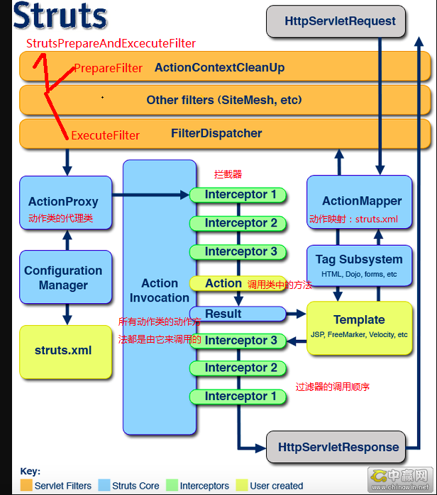
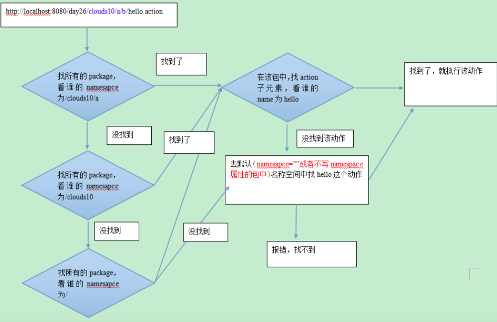

struct2基本淘汰，主要SpringMVC，Springboot等的开发非常便利，但因为有些旧项目依然在用struct2，所以大概总结一下

主要解决一些开发中常用的功能：怎么写业务逻辑（与jsp或者前后分离时，怎么用json交互），怎么写拦截器，怎么写服务，

在web中怎么定义，怎么拦截请求等

[structs2](https://cloud.tencent.com/developer/article/1691134)

[struct2总结，总结挺不错的](https://cloud.tencent.com/developer/article/1691134)

[struct2总结](https://cloud.tencent.com/developer/article/1509324)

## Struts2的基本组成

​		Struts2有3部分组成：核心控制器(FilterDispatcher)、业务控制器和用户实现的业务逻辑组件，其中FilterDispatcher是由Struts2框架提供的，而用户需要手动实现业务控制器(Action)和业务逻辑组件(就是业务逻辑部分)

## **核心控制器：FilterDispatcher** 

 	FilterDispatcher是Struts 2框架的核心控制器，该控制器作为一个Filter运行在Web应用中，它负责拦截所有的用户请求，当用户请求到达时，该Filter会过滤用户请求。如果用户请求以action结尾，**该请求将被转入Struts 2框架处理**。

​	**Struts 2框架获得了\*.action请求后，将根据\*.action请求的前面部分决定调用哪个业务逻辑组件，例如，对于login.action请求，Struts 2调用名为login的Action来处理该请求。** 

​	Struts 2应用中的Action都被定义在struts.xml文件中，在该文件中定义Action时，定义了该Action的name属性和class属性，其中name属性决定了该Action处理哪个用户请求(请求和method方法中的action名字对应)，而class属性决定了该Action的实现类。Struts 2用于处理用户请求的Action实例，并不是用户实现的业务控制器，而是Action代理——因为用户实现的业务控制器并没有与Servlet API耦合，显然无法处理用户请求。而Struts 2框架提供了系列拦截器，该系列拦截器负责将HttpServletRequest请求中的请求参数解析出来，传入到Action中，并回调Action 的execute方法来处理用户请求。 

**显然，上面的处理过程是典型的AOP（面向切面编程）处理方式**

**从上图可以看出：用户实现的Action类仅仅是Struts 2的Action代理的代理目标。用户实现的业务控制器（Action）则包含了对用户请求的处理。用户的请求数据包含在 HttpServletRequest对象里，而用户的Action类无需访问HttpServletRequest对象。拦截器负责将 HttpServletRequest里的请求数据解析出来，并传给业务逻辑组件Action实例。**

## 业务控制器 

 **业务控制器组件就是用户实现Action类的实例，Action类里通常包含了一个execute方法，该方法返回一个字符串——该字符串就是一个逻辑视图名，当业务控制器处理完用户请求后，根据处理结果不同，execute方法返回不同字符串   ——每个字符串对应一个视图名。**  **程序员开发出系统所需要的业务控制器后，还需要配置Struts 2的Action，即需要配置Action的如下三个部分定义：**  **—  Action所处理的URL。**  **—  Action组件所对应的实现类。**  **—  Action里包含的逻辑视图和物理资源之间的对应关系。**  **每个Action都要处理一个用户请求，而用户请求总是包含了指定URL。当Filter Dispatcher拦截到用户请求后，根据请求的URL和Action处理URL之间的对应关系来处理转发。**

## **Struts 2的模型组件** 

  **通常，MVC框架里的业务控制器会调用模型组件的方法来处理用户请求。也就是说，业务逻辑控制器不会对用户请求进行任何实际处理，用户请求最终由模型组件负责处理。业务控制器只是中间负责调度的调度器，这也是称Action为控制器的原因。**   **当控制器需要获得业务逻辑组件实例时，通常并不会直接获取业务逻辑组件实例，而是通过工厂模式来获得业务逻辑组件的实例；或者利用其他IoC容器（如Spring容器）来管理业务逻辑组件的实例。** 

## **Struts 2的视图组件** 

  **Struts 2已经改变了Struts 1只能使用JSP作为视图技术的现状，Struts 2允许使用其他的模板技术，如FreeMarker、Velocity作为视图技术。**  **当Struts 2的控制器返回逻辑视图名时，逻辑视图并未与任何的视图技术关联，仅仅是返回一个字符串，该字符串作为逻辑视图名。**  **当我们在struts.xml文件中配置 Action时，不仅需要指定Action的name属性和class属性，还要为Action元素指定系列result子元素，每个result子元素定义一个逻辑视图和物理视图之间的映射。前面所介绍的应用都使用了JSP技术作为视图，故配置result子元素时没有指定type属性，默认使用JSP 作为视图资源。**  **如果需要在Struts 2中使用其他视图技术，则可以在配置result子元素时，指定相应的type属性即可。例如，如果需要使用FreeMarker，则为result指定值为freemarker的type属性；如果想使用Velocity模板技术作为视图资源，则为result指定值为velocity的type属性……**    **经过上面介绍，我们发现Struts 2框架的其实就webwork2.2的升级版** 

**一个请求在Struts2框架中的处理大概分为以下几个步骤**  

		1.  客户端初始化一个指向Servlet容器（例如Tomcat）的请求
  		2.   这个请求经过一系列的过滤器（Filter）（这些过滤器中有一个叫做ActionContextCleanUp的可选过滤器，这个过滤器对于Struts2和其他框架的集成很有帮助，例如：SiteMesh Plugin）
  		3.  接着FilterDispatcher被调用，FilterDispatcher询问ActionMapper来决定这个请是否需要调用某个Action
  		4.  4 如果ActionMapper决定需要调用某个Action，FilterDispatcher把请求的处理交给ActionProxy 
  		5.  ActionProxy通过Configuration Manager询问框架的配置文件，找到需要调用的Action类
  		6.  ActionProxy创建一个ActionInvocation的实例。
  		7.   ActionInvocation实例使用命名模式来调用，在调用Action的过程前后，涉及到相关拦截器（Intercepter）的调用。
  		8.   一旦Action执行完毕，ActionInvocation负责根据struts.xml中的配置找到对应的返回结果。返回结果通常是（但不总是，也可 能是另外的一个Action链）一个需要被表示的JSP或者FreeMarker的模版。在表示的过程中可以使用Struts2 框架中继承的标签。在这个过程中需要涉及到ActionMapper,在上述过程中所有的对象（Action，Results，Interceptors，等）都是通过ObjectFactory来创建的。

## struct2返回json格式

[struct2返回json的方法,实现restful接口，继承json-default，重点看](https://blog.csdn.net/feinifi/article/details/81114268)

[struct2返回json格式的几种方法](https://www.cnblogs.com/hangdada/p/4983002.html)

# 疑问

总结company项目怎么实现的struct2返回json，具体采用的什么方法。